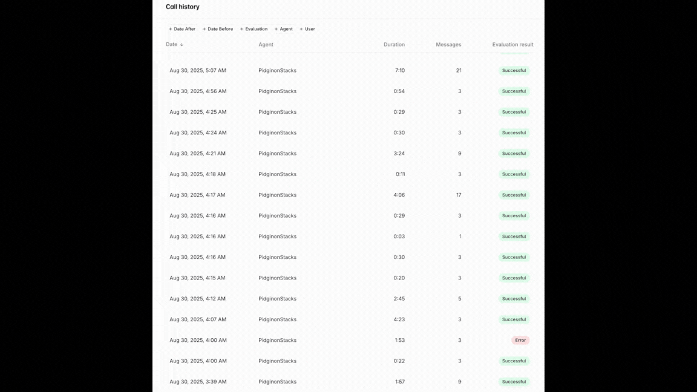
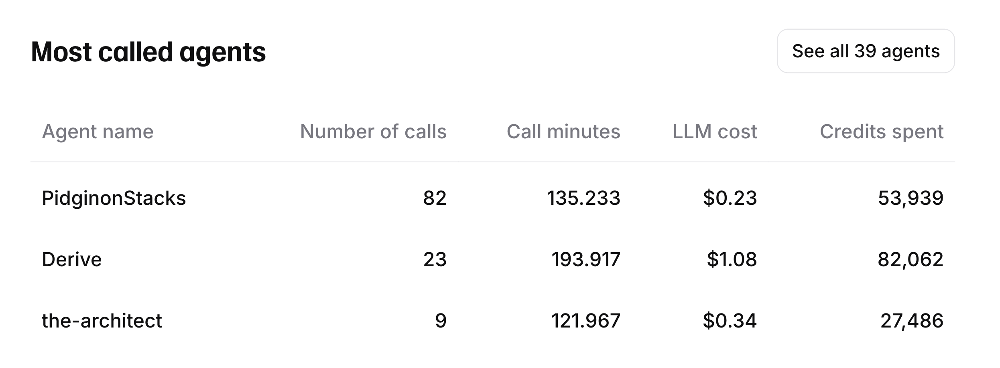

# TokTok (A Stacks AI Guild Submission)

Created for the Dora Hacks Stacks sBTC Hackathon September 4, 2025.

> **Think Global, Act LOCAL** - Onboarding the next million Nigerian Bitcoin millionaires in their native tongue: Pidgin.

**Special thanks to PeaceLoveMusic, GPSC, 3Hunna, Hero, Haddy, JackbinSwitch, CryptoDude, Rocky and the entire Stacks AI Guild for making this possible**

## 🚀 Live Demo
**[Try TokTok Now → http://pidginonstacks.carrd.co](http://pidginonstacks.carrd.co)**

## About

TokTok is a revolutionary Bitcoin payment application designed specifically for the Nigerian market, built on the Stacks blockchain with sBTC integration. Our mission is to bridge the gap between traditional financial systems and Bitcoin adoption by providing an intuitive, culturally-appropriate interface that speaks to users in Pidgin English.

### Key Features
- 🌍 **Pidgin English Interface**: Native language support for Nigerian users
- 💰 **sBTC Integration**: Seamless Bitcoin-to-Stacks transactions
- 🔒 **Secure Smart Contracts**: Built on Stacks blockchain with Clarity
- 💳 **Payment Gateway**: Powered by sBTC Pay for simple Bitcoin payments
- 📱 **Mobile-First Design**: Optimized for smartphone usage
- 🧪 **Testnet Ready**: Safe testing environment for development

### Technology Stack
- **Blockchain**: Stacks (Bitcoin Layer 2)
- **Smart Contracts**: Clarity
- **Payment Processing**: sBTC Pay
- **Token Standard**: SIP-010 compliant fungible tokens
- **Cross-Chain**: Bitcoin ↔ Stacks bridge functionality

## Think Global, Act LOCAL

**Onboarding the next million Nigerian Bitcoin millionaires in their native tongue: Pidgin.**

## Problem-Worth Solving | Job-to-be-Done

What we have is a problem to communicate.

Do you know how Mr. Beast blew up? By thinking globally and acting locally.

Mr. Beast blew up because he hired well-known actors to re-dub his voice on his videos. There are stories of him hiring the voice actor for Spider-Man to re-dub his voice in different countries.

## Solution

What the learner learns is a function of what they already know.
- The Kullback-Leibler Divergence

Acting globally and thinking locally is how we onboard the next million Nigerian millionaires to the Stacks ecosystem. Nigeria already houses a large percentage of the world's bitcoin millionaires...it's time to zero to n this achievement by reimaigining and onboarding and UI/UX interface that speaks in the native Nigerian tongue: pidgin.

## 💳 Payment Gateway Integration

TokTok is powered by **sBTC Pay**, a revolutionary Bitcoin payment gateway that enables simple Bitcoin payments for developers.

### 🔗 Powered by sBTC Pay
- **Website**: [http://www.sbtcpay.org](http://www.sbtcpay.org)
- **Developer**: [@kai_builder](https://x.com/kai_builder)
- **Documentation**: [sBTC Pay Documentation](https://sbtcpay.org/docs)

## 🔧 Technical Implementation

### sBTC Clarity Contract (author: @kai_builder on X | http://www.sbtcpay.org)

TokTok is built on the Stacks blockchain using a custom Clarity smart contract (`smart-contracts/sbtcpayorg.clar`) that implements sBTC (Stacks Bitcoin) functionality:

#### Key Features:
- **Dual Token System**: Implements both `sbtc-token` (available) and `sbtc-token-locked` (locked) fungible tokens
- **Protocol Functions**: Secure minting, burning, locking, and unlocking operations with protocol-level authorization
- **SIP-010 Compliance**: Full compatibility with Stacks Improvement Proposal 010 for fungible tokens
- **Batch Operations**: Efficient bulk transfers and minting for improved user experience
- **Security**: Contract-caller validation ensures only authorized protocols can perform critical operations

#### Core Functions:
- `protocol-lock`: Locks sBTC tokens for Bitcoin bridge operations
- `protocol-unlock`: Unlocks sBTC tokens back to available state
- `protocol-mint`: Mints new sBTC tokens to recipients
- `transfer-many`: Batch transfer functionality for multiple recipients
- `get-balance`: Retrieves total, available, and locked token balances

The contract integrates with the sBTC registry for secure cross-chain Bitcoin operations, enabling seamless Bitcoin-to-Stacks transactions in Pidgin English.

## 📱 Usage

See TokTok in action with our comprehensive usage demonstrations:

These demonstrations show the complete user journey through TokTok's Pidgin English interface, showcasing how Nigerian users can seamlessly interact with Bitcoin and sBTC through our intuitive, culturally-appropriate design.

### ⚠️ Important Notice
**TESTNET ONLY** - This application currently supports testnet wallets only. Do not use mainnet wallets or send real Bitcoin.

**Get sBTC faucet**: [sBTC Faucet](https://sbtcpay.org/faucet)

### 🚀 Quick Start Features

#### API Endpoints
- **Base URL**: `https://sbtcpay.org/api/v1`
- **Authentication**: Bearer token authentication
- **Test API Key**: `sk_test_....`

#### Core Functionality
- **Product Management**: Create, update, and manage products for sale
- **Payment Intents**: Generate payment intents for customers
- **Payment Links**: Create shareable payment links with customization
- **Customer Management**: Track customers and their transaction history
- **Webhook Support**: Real-time payment notifications

#### Key API Endpoints
- `POST /products` - Create new products
- `POST /payment_intents` - Create payment intents
- `POST /payment-links` - Generate payment links
- `GET /customers` - List customers with successful payments
- `GET /payment_intents` - Retrieve payment intents

### 🔧 Integration Benefits
- **Simple Bitcoin Payments**: Streamlined sBTC payment processing
- **Developer-Friendly**: RESTful API with comprehensive documentation
- **Testnet Support**: Safe testing environment for development
- **Real-time Updates**: Webhook integration for payment status updates
- **Customer Tracking**: Complete transaction and customer management

The sBTC Pay integration enables TokTok to process Bitcoin payments seamlessly while maintaining the security and decentralization benefits of the Stacks blockchain.

## Total Addressable Market

As of 2024, Nigeria has emerged as a significant hub for Bitcoin adoption, with a substantial number of Bitcoin millionaires contributing to its prominence in the global cryptocurrency landscape.

---

### 🌍 Global Bitcoin Millionaires Overview

According to the 2024 Crypto Wealth Report, the number of individuals worldwide holding over \$1 million in Bitcoin has surged by 111% to 85,400. This growth reflects the increasing global interest and investment in Bitcoin as a digital asset.

---

### 🇳🇬 Nigeria's Bitcoin Millionaire Landscape

Nigeria stands out in Africa for its significant number of Bitcoin millionaires. The country has produced several notable figures who have amassed substantial wealth through Bitcoin investments and related ventures.

#### Top Bitcoin Millionaires in Nigeria (2025)

| Rank | Name                           | Estimated Net Worth | Notable Contributions                        |                             |
| ---- | ------------------------------ | ------------------- | -------------------------------------------- | --------------------------- |
| 1    | Ifeanyi Ezenwaogene            | \$12 million        | Crypto investor and educator                 |                             |
| 2    | Gaius Chibueze (Bitcoin Chief) | \$10 million        | Crypto influencer and entrepreneur           |                             |
| 3    | Hanu Fejiro Agbodje            | \$8.9 million       | Co-founder of Patricia Technologies          |                             |
| 4    | Onomor Eseoghene               | \$7 million         | Expert trader and analyst                    |                             |
| 5    | Linus Williams Ifejika (BLord) | \$7 million         | Entrepreneur and blockchain advocate         |                             |
| 6    | Buchi Okoro                    | \$4 million         | Founder of Quidax, a cryptocurrency exchange |                             |
| 7    | Tola Joseph Fadugbagbe         | \$4 million         | Crypto analyst and educator                  |                             |
| 8    | Fidelis Ozuawala (SunnEx)      | \$3 million         | Investor and influencer                      |                             |
| 9    | Chris Ani                      | \$2 million         | Co-founder of Cryptocurrency Academy         | 

These individuals have not only achieved financial success but also played pivotal roles in educating and promoting cryptocurrency adoption across Nigeria. 

---

### 📊 Visual Representation

Bitcoin Adoption by Country: https://plasbit.com/blog/bitcoin-adoption-by-country

*This heatmap illustrates Bitcoin adoption levels across various countries, highlighting Nigeria's significant presence in the cryptocurrency space.*

---

### 🔍 Political Legal Regulatory & Compliance Climate

* Nigeria's adoption of Bitcoin is driven by factors such as economic instability, inflation, and currency devaluation, making it a vital resource for youth and businesses.

* The country's regulatory environment and the increasing number of crypto exchanges have facilitated the growth of cryptocurrency adoption and investment.

---